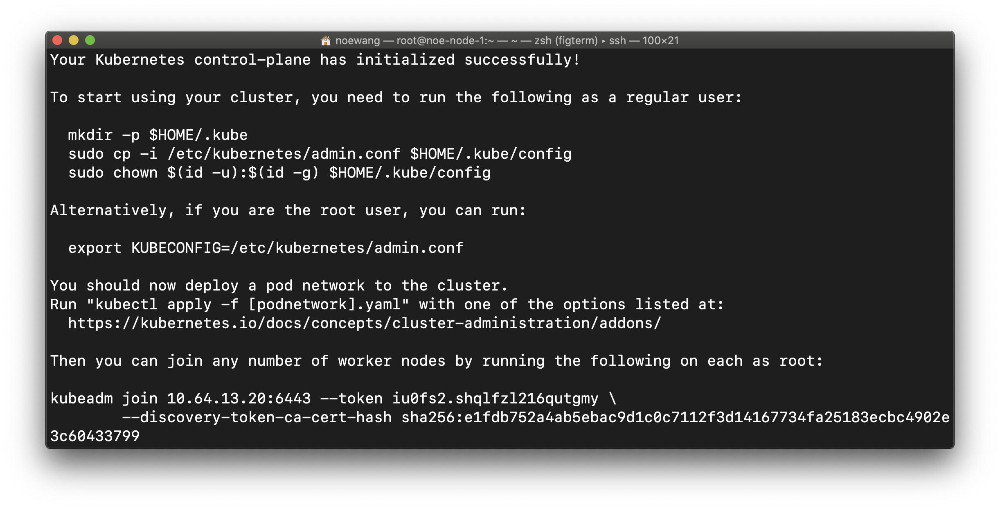
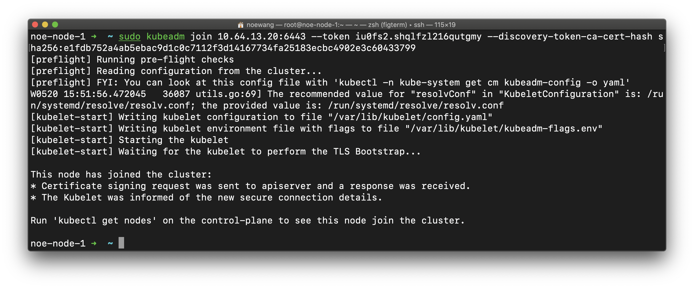
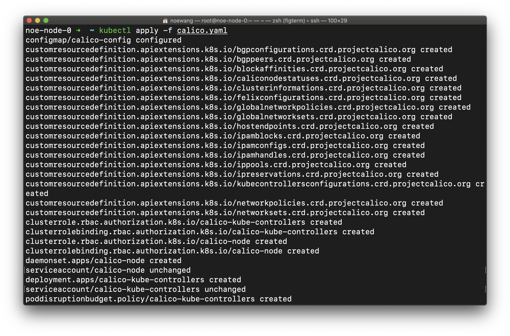
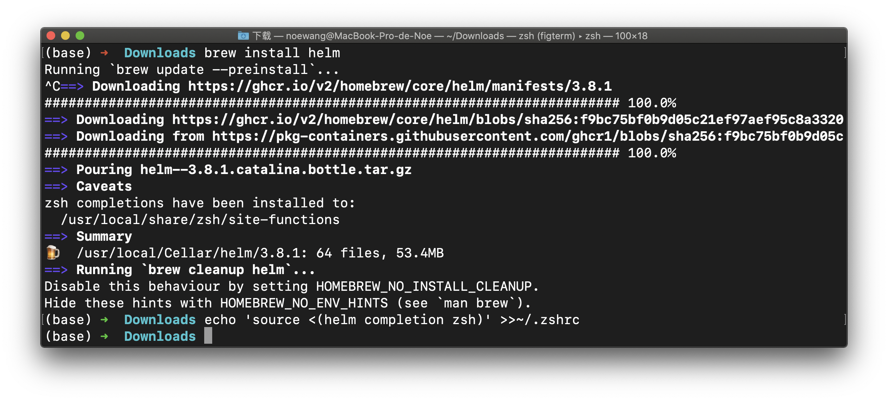

## 2. 创建多节点K8S集群

本章节记录了一个有3个节点的K8S集群的配置过程

### 2.1 总结

> 对于K8S这个快速发展的项目，<u>**一定一定一定**</u>要注意参考资料的版本 ！！！！！
> 这是前人血和泪的教训，当然你可以自己尝一尝，印象会更加深刻：）

| Component      | Verison | Ref  |
| -------------- | ------- | ---- |
| kubeadm        | 1.23.6  | ---  |
| kubectl        | 1.23.6  | ---  |
| kubelet        | 1.23.6  | ---  |
| metrics-server | 0.6.1   | ---  |
| calico         | 3.22.2  | ---  |

### 2.2 确保服务器资源

本小节描述了集群资源的情况

#### 服务器配置

我们假设有三台互相连接的节点，这些节点在一个交换机域下。三个节点的主机名、IP地址描述如下

```mermaid
graph LR
    B[Internet] --> A[(vSwitch)]
    subgraph Hypervisor
        A --> C1[noe-node-0<br>10.64.13.20]
        A --> C2[noe-node-1<br>10.64.13.21]
        A --> C3[noe-node-2<br>10.64.13.22]
    end
```


```yaml
nodes:
  - noe-node-0:
      hostname: 'noe-node-0'
      address: '10.119.12.1'
  - node1:
      hostname: 'noe-node-1'
      address: '10.119.12.3'
  - node2:
      hostname: 'noe-node-2'
      address: '10.119.12.4'
```

三台节点均为x86虚拟机，安装Ubuntu 20.04.3 LTS操作系统，配置了2核CPU和4GB内存。`noe-node-0`将作为控制平面所在的节点

> - 必须确保`product_uuid`的唯一性，可以用`sudo cat /sys/class/dmi/id/product_uuid`检查
>
> - `hostnamectl` 可以修改主机名

#### 令服务器互相连接

我们编辑节点的`/etc/hosts` 来让它们能够通过主机名互相访问。节点0上的配置如下：

```
10.64.13.20   noe-node-0
10.64.13.21   noe-node-1
10.64.13.22   noe-node-2
10.64.13.100  storage
```

> 可以通过`ping`命令来测试主机间的连通性 !!! tip 应当使用`ifconfig`配置static IP，并使得节点间可以通过默认路由通讯 !!! note 确保`br_netfilter`模块已经加载。
>
> 可以通过`lsmod | grep br_netfilter`检查。使用`sudo modprobe br_netfilter`主动加载

```shell
$ lsmod | grep br_netfilter
br_netfilter           28672  0
bridge                249856  1 br_netfilter
```

> warning 如果是复制的虚拟机，则必须确保三台主机的MAC地址的唯一性，可以用`ip link`或者`ifconfig -a`获取mac地址。

#### 安装Docker

我们在第一个节点安装Docker，并将第一个节点复制三份。

```shell
curl -fsSL https://get.docker.com -o get-docker.sh
sudo sh get-docker.sh
sudo usermod -aG docker $USER
newgrp docker
sudo systemctl restart docker
```

#### 关闭防火墙和swap

关闭`ufw`、`SELinux`等所有的防火墙，但是不要关闭`iptables`，因为`iptables`会被用来作流量转发

> 使用`sudo ufw disable`关闭`ufw`防火墙

修改`/etc/stab`，将`/swap`有关的配置注释从而关闭swap。

```shell
sudo vim /etc/fstab
```

- `swapoff -a` 可以临时做到这一点
- `6443`端口被用来作集群间通讯，需要确保不被占用。使用`lsof -i | grep 6443`确认，如果没有结果则为不占用

### 2.3 安装相关工具

我们需要安装以下工具：

- `kubectl`: 用来与集群通信的命令行工具
- `kubeadm`: 用来初始化集群的指令
- `kubelet`: 在集群中的每个节点上用来启动 Pod 和容器等

> ！！！！！！！是在所有节点都安装！！！！！！！！！！！！！

#### kubectl / kubeadm / kubelete

安装必要的工具（理论上kubectl只需要在主节点/控制平面所在节点进行）

```shell
sudo apt-get update
sudo apt-get install -y apt-transport-https ca-certificates curl
```

添加仓库签名密钥

```shell
sudo curl -fsSLo /usr/share/keyrings/kubernetes-archive-keyring.gpg \
                        https://mirrors.aliyun.com/kubernetes/apt/doc/apt-key.gpg 
```

> 删除`/usr/share/keyrings/kubernetes-archive-keyring.gpg`可以删除该密钥

添加仓库

```shell
echo "deb [signed-by=/usr/share/keyrings/kubernetes-archive-keyring.gpg] https://mirrors.aliyun.com/kubernetes/apt/ kubernetes-xenial main" | sudo tee /etc/apt/sources.list.d/kubernetes.list
```

> 删除`/etc/apt/sources.list.d/kubernetes.list`文件可以删除该仓库

```shell
sudo apt-get update
sudo apt-get install -y kubelet=1.23.6-00 kubeadm=1.23.6-00 kubectl=1.23.6-00
sudo apt-mark hold kubelet kubeadm kubectl
```

> ！！！！！！！！！！！！！！！！！！！！！！！！！！！！！！！！！！！！！！！！！！！！！！！！！！！！！！！！！！！！！！！！！！！！！！！！！！！！！！！！！！！！！！！！！！！！！！！！！！！！！！！！！我们必须安装1.23版本，因为1.24版本移除了对docker运行时的支持！！！！！！！！！！！！！！！！！！！！！！！！！！！！！！！！！！！！！！！！！！！！！！！！！！！！！！！！！！！！！！！！！！！！！！！！！！！！！！！！！！！！！！！！！！！！！！！！！！！！！！！！！！！！！！！！！！！
>
> 锁定版本可以避免一些兼容性问题

#### NFS

NFS是非常常见的网络存储协议。Kubernetes 不包含内部 NFS 驱动。你需要使用外部驱动为 NFS 创建 StorageClass.

[kubernetes-sigs/nfs-subdir-external-provisioner](https://github.com/kubernetes-sigs/nfs-subdir-external-provisioner)是一个流行的为K8S集群提供NFS的项目

首先，需要创建一个有NFS能力的节点。这里我们选择创建一台独立的节点用于提供NFS服务。该节点的主机名为`storage0`。我们需要在`storage0`节点上安装`nfs-common`, `nfs-kernel-server`套件

```bash
sudo apt-get install nfs-common nfs-kernel-server
```

所有的K8S节点都是NFS客户端，需要安装`nfs-common`组件。客户端挂载NFS存储有两种方式

- 单次挂载

```shell
mount -tnfs server_ip:/path/to/server_data /path/to/client_data
```

其中`server_ip`是NFS服务器IP(`storage0`节点IP)，`/path/to/server_data`为NFS服务器的共享路径。`/path/to/client_data`为本地挂载路径

- 开机启动挂载

需要修改`/etc/fstab`，添加挂载配置

```
server_ip:/path/to/server_data  /path/to/client_data nfs rsize=8192,wsize=8192,timeo=14,intr
```

在本实验中，我们把`storage0（10.64.13.100）`的`/data`挂载到本机的`/data`：

```
10.64.13.100:/data  /data nfs rsize=8192,wsize=8192,timeo=14,intr
```

- mount之前一定要本地有要挂载的目录

```shell
mkdir /data
mount -a
```


### 2.4 安装集群

本小节描述了安装集群的情况

#### 安装控制平面/主节点

由于网络建设的原因，`k8s.gcr.io`在国内访问速度极慢，需要配置镜像加速。

```shell
sudo kubeadm init --image-repository registry.aliyuncs.com/google_containers \
                  --apiserver-advertise-address 10.64.13.20 \
                  --pod-network-cidr=10.123.0.0/16 \
```

> `registry.aliyuncs.com/google_containers `这个Repo其实是一个用户同步的。davidliyutong也同步了部分google的镜像源于`registry.hub.docker.com/davidliyutong`，可以使用这个源替换

- `--apiserver-advertise-address` 为证书IP，最好设成节点的公网IP以便远程访问
- `--pod-network-cidr` 为Pod分配`CIDR`，不能和主机的任何子网冲突

> 如果出现报错：cgroup不一致，则需要添加`"exec-opts": ["native.cgroupdriver=systemd"]`到`/etc/docker/daemon.json`，这个报错需要执行kubelet来查看，你并不会在kubeadm的报错里看到。

在`/etc/docker/daemon.json`添加下面三行
```json
{
    "exec-opts": ["native.cgroupdriver=systemd"]
}
```

然后记得重新启动docker

```shell
systemctl restart docker
```

令Docker以systemd为cgroup driver（kubelete的默认设置）



- 输出的`token-ca-cert-hash` 要保存好，下面`kubeadm join` 要使用

```shell
kubeadm join 10.64.13.20:6443 --token iu0fs2.shqlfzl216qutgmy \
	--discovery-token-ca-cert-hash sha256:e1fdb752a4ab5ebac9d1c0c7112f3d14167734fa25183ecbc4902e3c60433799 
```

- 不要忘记在其他节点的`/etc/docker/daemon.json`也进行修改

> `kubeadm config images pull --image-repository registry.aliyuncs.com/google_containers`可以提前拉取镜像


#### 添加其他节点

在其他节点上运行kubeadm加入集群

```shell
sudo kubeadm join 10.64.13.20:6443 --token $TOKEN \
        --discovery-token-ca-cert-hash $HASH
```

- `10.64.13.20`为主节点IP
- `6443`为默认端口
- `$TOKEN`为之前主节点初始化后输出的token
- `$HASH`为之前主节点初始化后输出的hash



> token会在24小时后过期，因此需要及时执行节点加入操作，超时则需要重新生成token

生成token的命令

```shell
[noe-node-0] $ kubeadm token create
```

生成cat-cert-hash的命令（需要在控制平面节点执行）

```shell
[noe-node-0] $ openssl x509 -pubkey -in /etc/kubernetes/pki/ca.crt | openssl rsa -pubin -outform der 2>/dev/null | \
[noe-node-0] $ openssl dgst -sha256 -hex | sed 's/^.* //'
```

根据提示，如果要以普通用户的身份使用集群，需要执行下列函数将`admin.conf`拷贝到用户的当前目录下，**并赋予正确的权限**

```shell
[noe-node-0] $ mkdir -p $HOME/.kube
[noe-node-0] $ sudo cp -i /etc/kubernetes/admin.conf $HOME/.kube/config
[noe-node-0] $ sudo chown $(id -u):$(id -g) $HOME/.kube/config
[noe-node-0] $ echo "export KUBECONFIG=$HOME/.kube/config" >> $PROFILE
```

> `$PROFILE`为终端的配置文件，例如ZSH的配置文件为`$HOME/.zshrc`

如果是root用户，则需要执行以下命令

```shell
[root@noe-node-0] $ echo "export KUBECONFIG=/etc/kubernetes/admin.conf" >> $PROFILE
```

#### 配置网络

本次安装的calico版本是v3.22.2

现在，`kubectl get nodes`应该能看到所有的node，但他们没有Ready，这是因为没有配置网路插件

接下来，我们在`noe-node-0`下载并应用calico网络插件

```bash
curl https://docs.projectcalico.org/manifests/calico.yaml -O
```

>  网上有各种参考[Installing Calico for policy and networking](https://projectcalico.docs.tigera.io/archive/v3.7/getting-started/kubernetes/installation/calico)的博客认为需要执行`sed -i -e "s?192.168.0.0/16?$POD_CIDR?g" calico.yaml`将IP替换，实测最新版是不需要的。只要在kubeadm初始化的时候指定了`--pod-network-cidr=x.x.x.x/y`

```bash
kubectl apply -f calico.yaml
```

可以安装`calicoctl`这个二进制工具

```shell
curl -L https://github.com/projectcalico/calico/releases/download/v3.22.2/calicoctl-linux-amd64 -o calicoctl
sudo install calicoctl /usr/local/bin
```



`calicoctl node status`可以查看节点的状态


> 如果系统中有NetworkManager（例如Ubuntu），需要配置NetworkManager以免对calico产生干扰。最佳实践是使用`apt-get remove network-manager`卸载

> 删除calico需要以下步骤

- `kubectl  delete -f calico.yaml`可以删除calico的部署
- 删除节点的tunl0设备`modprobe -r ipip`
- 删除`/etc/cni/net.d/`下所有calico相关的文件，这是删除CNI插件
- 所有节点重启kubelet，`systemctl restart kubelet`
- 删除coredns的pod，`kubectl delete pod coredns-xxxxxxxxx-xxxxx`

#### 测试

```shell
kubectl get nodes
```


### 2.5 其他的实用配置

#### RBAC

使用kubeadm搭建的集群默认开启RBAC

#### 使用配置文件初始化

`kubeadm config print init-defaults > configfile.yaml`可以将kubeadm的默认配置保存到一个`configfile.yaml`。修改这个文件，然后从配置文件初始化集群，可以加入很多自定义的配置

#### 开启IPVS

官方文档说明，IPVS能够支持更大的K8S规模，带来更低的网络延时。

首先，确保有关的内核模块已经加载

```bash
sudo lsmod | grep ip_vs
```

确保结果中存在 `ip_vs`、`ip_vs_rr`、`ip_vs_wrr`、`ip_vs_sh`、`nf_conntrack`


如果没有，则加载相关模块

```
sudo modprobe -- ip_vs
sudo modprobe -- ip_vs_rr
sudo modprobe -- ip_vs_wrr
sudo modprobe -- ip_vs_sh
sudo modprobe -- nf_conntrack
```

>- 将这些`modprobe`mingling添加进`/etc/rc.local`以使能开机加载新版内核默认加载这些模块

> - 早期的kube-proxy对`nf_conntrack_ipv4`有强制要求

安装`ipvsadm`和`ipset`

```bash
sudo apt-get install ipvsadm ipset
kubectl edit cm -n kube-system  kube-proxy
```

修改`mode`的值为`ipvs`


获取kube-proxy的Pod

```bash
kubectl get pods -n kube-system | grep proxy                                       
```


通过删除Pod，令其自动重启（kube-proxy并不会被真正删除）

```bash
kubectl delete  pod -n kube-system  kube-proxy-nlmg5
kubectl delete  pod -n kube-system  kube-proxy-nwrkk
kubectl delete  pod -n kube-system  kube-proxy-q9clf
```

重启后，kube-proxy会自动侦测K8S集群的配置模式，并工作在IPVS模式下

> 别担心，他们会自动重启


#### 启用TLSBootstrap

安装metrics-server时候可能会遇到metrics-server启动但是不可用的问题，这是因为metrics-server默认会检查worker节点的InternalIP是否与节点证书匹配，而节点签发证书的时候只包含了自身的主机名。解决方法就是启用`TLSBootstrap`

参考[证书签名请求](https://kubernetes.io/zh/docs/reference/access-authn-authz/certificate-signing-requests/)我们需要修改kubeadm的ConfigMap，使用`kubectl get cm -n kube-system`获取`kube-system`命名空间下的ConfigMap

```bash
kubectl get cm -n kube-system
```


修改ConfigMap

```
kubectl edit cm kubelet-config-1.23 -n kube-system
```

将会打开一个VI编辑器供修改


在`data.kubelet`下，添加`serverTLSBootstrap: true`键值对

修改**所有**节点的`/var/lib/kubelet/config.yaml`，进行同样的改动，然后重启kubelet

```bash
vim /var/lib/kubelet/config.yaml
systemctl restart kubelet
```

在控制平面节点上，使用`kubectl get csr`查看APIServer得到的CSR申请

```bash
kubectl get csr
```


使用`kubectl certificate approve` 命令批准每一个证书

```
kubectl certificate approve csr-xxxxx
```


#### 添加命令补全

如果想为kubectl添加终端的自动补全，根据使用的Shell不同可以执行如下命令

- Bash

```shell
echo 'source <(kubectl completion bash)' >>~/.bashrc
```

- Zsh

```shell
echo 'source <(kubectl completion zsh)' >>~/.zshrc
```


#### 安装Helm

Helm是一种K8S包管理工具，具体介绍可以参考[第五章](../../5_Helm/README.md))

- Linux

```shell
curl -fsSL -o get_helm.sh https://raw.githubusercontent.com/helm/helm/main/scripts/get-helm-3
bash get_helm.sh

```

> 这会安装最新版本的Helm

- Linux Binary

```shell
curl -LO https://get.helm.sh/helm-v3.8.0-linux-amd64.tar.gz # 3.8.0为版本号, amd64为架构
tar -xvf helm-v3.8.0-linux-amd64.tar.gz
sudo install ./linux-amd64/helm /usr/local/bin/helm
```

> 这会安装指定架构和版本的Helm

- MacOS

```shell
brew install helm
# brew install helm@3.8.0
```
> 这会安装指定版本的Helm

如果想为helm添加终端的自动补全，根据使用的Shell不同可以执行如下命令

- Bash

```shell
echo 'source <(helm completion bash)' >>~/.bashrc
```

- Zsh

```shell
echo 'source <(helm completion zsh)' >>~/.zshrc
```

Helm不一定要安装在集群的节点上。它可以被安装在遥控集群的节点上



> 遥控节点：
> 
> Name: MacBook Pro de Noe
> 
> OS: MacOS Catalina 10.15.7
