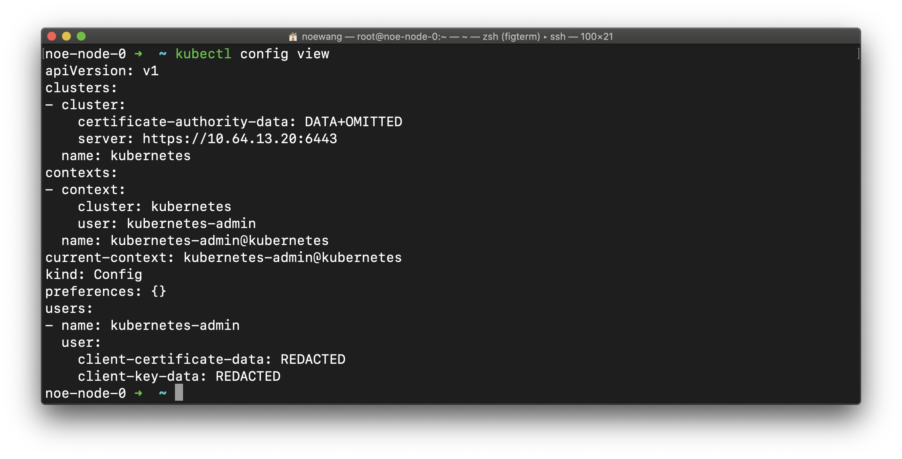
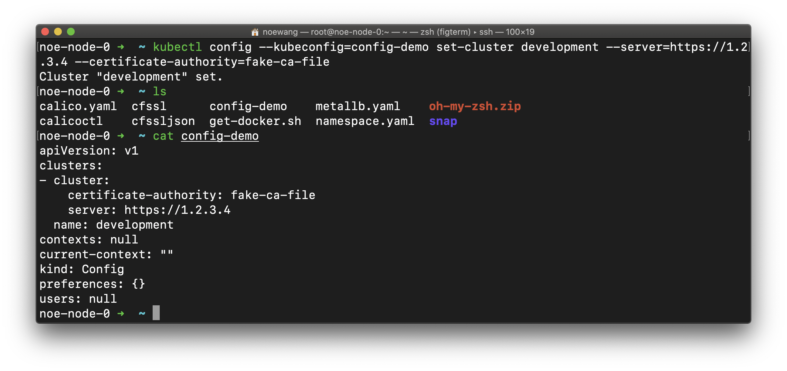
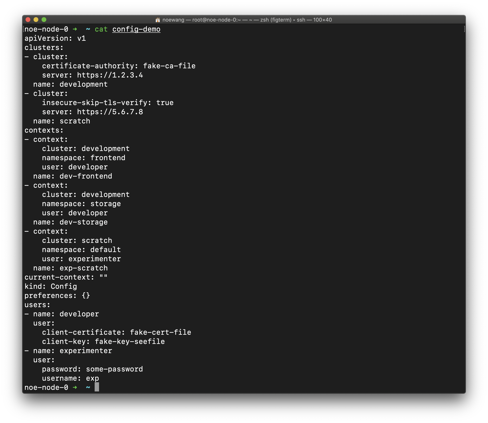
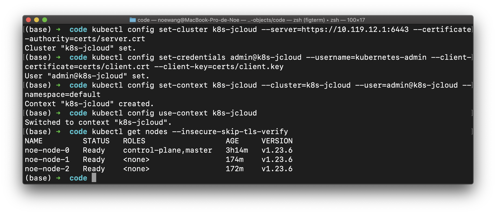
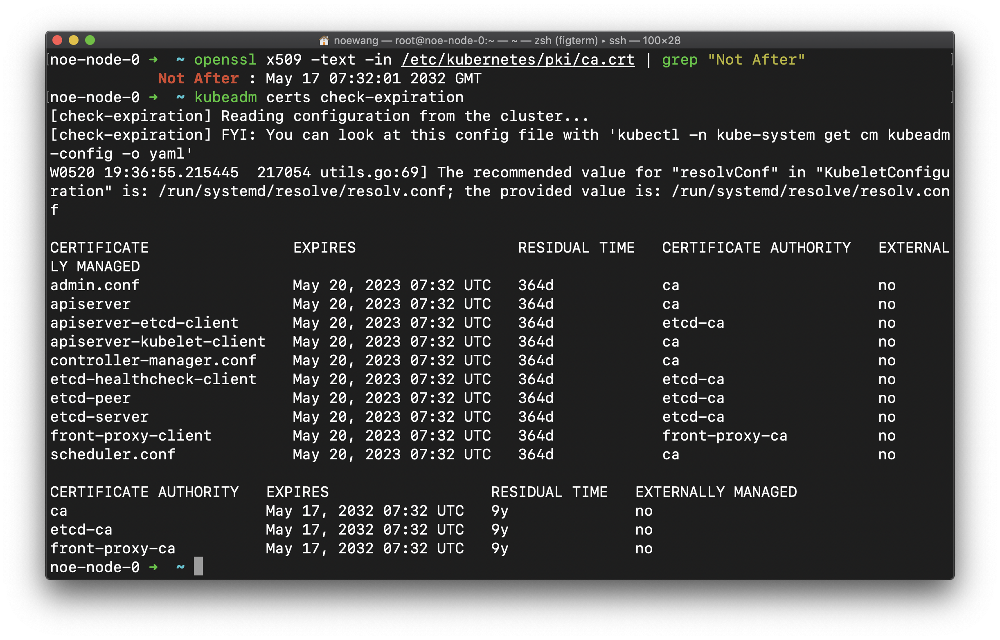

## 1. Config

### 1.1 Context related

- 我们在`noe-node-0`上查看设置

```bash
kubectl config view
```



- 查看本地context

```bash
kubectl config get-contexts
```

> 该操作查看的是本地记录的context，取决于当前用户目录下`.kube/config`的内容或者是KUBECONFIG变量定义的配置文件的内容


- 查看当前使用的Context

```bash
kubectl config current-context
```


使用`kubectl config --kubeconfig=${PATH_TO_CONFIG}`可以新增、修改配置文件。`${PATH_TO_CONFIG}`要被替换成配置文件的路径。如果该路径不存在则会被创建

- 添加一个cluster，名为`development`，地址是`https://1.2.3.4`，证书是`fake-ca-file`

    ```shell
    kubectl config --kubeconfig=config-demo set-cluster development --server=https://1.2.3.4 --certificate-authority=fake-ca-file
    ```

> 证书是PEM格式的
> ```pem
> -----BEGIN CERTIFICATE-----
> ...
> -----END CERTIFICATE-----
> ```



> 我们可以看到，当第一行执行完后，目录下多出了一个config-demo文件，这是因为运行命令时指定了`config-demo`作为配置文件名

- 添加一个cluster，名为`development`，不验证证书

    ```shell
    kubectl config --kubeconfig=config-demo set-cluster scratch \
                             --server=https://5.6.7.8 \
                             --insecure-skip-tls-verify
    ```

- 添加一个credential，名为`developer`，使用公私钥认证

    ```shell
    kubectl config --kubeconfig=config-demo set-credentials \
                             developer \
                             --client-certificate=fake-cert-file \
                             --client-key=fake-key-seefile
    ```

- 添加一个credential，名为`experimenter`，使用用户名-密码认证

    ```shell
    kubectl config --kubeconfig=config-demo set-credentials \
                             experimenter \
                             --username=exp \
                             --password=some-password
    ```

- 添加一个context，名为`dev-frontend`，位于`frontend`命名空间下，使用用户`developer`和集群`development`

    ```shell
    kubectl config --kubeconfig=config-demo set-context \
                            dev-frontend \
                            --cluster=development \
                            --namespace=frontend \
                            --user=developer
    ```

- 添加一个context，名为`dev-storage`，位于`storage`命名空间下，使用用户`developer`和集群`development`

    ```shell
    kubectl config --kubeconfig=config-demo set-context \
                             dev-storage \
                             --cluster=development \
                             --namespace=storage \
                             --user=developer
    ```

- 添加一个context，名为`exp-scratch`，位于`default`命名空间下，使用用户`experimenter`和集群`scratch`

    ```shell
    kubectl config --kubeconfig=config-demo set-context \
                             exp-scratch \
                             --cluster=scratch \
                             --namespace=default \
                             --user=experimenter
    ```



> 执行完所有命令后，`config-demo`中的内容会发生大幅改变


这里放一张图描述`Config`和k8s的关系

```mermaid
flowchart LR
    subgraph K8S
        B1(contexts) --> B2(context1)
        B1(contexts) --> B4(...)

        B2 --> C1(cluster)
        B2 --> C2(user)
        B2 --> C3(namespace)

    end
    subgraph $HOME/.kube/config
        A1(clusters) -. + .-> A2[users] -- = --> A3[current-contex]
        A3[current-contex] --> B2

    end
```

因此：

```shell
[noe-node-0] $ kubectl config --kubeconfig=config-demo use-context dev-frontend
```

应该被解释为：

- 修改`config-demo`
- `use-context`，使用一个context
- `dev-frontend` context名字是`dev-frontend`

> 1. config文件的权限必须是`$USER.$GROUP:660`

> 2. 个人认为`kubectl config`只是提供了更好的修改config文件的方法，完全可以通过手动修改config做到这一点

> 3. `kubectl --insecure-skip-tls-verify` 选项可以跳过证书验证


### 1.2 实践 - 远程控制K8S

假设我们意图从一台笔记本连接在JCloud上部署好的集群（使用`kubeadm`部署）。我们首先查看`/etc/kubernetes/admin.conf`的内容


我们可以看到，`certificate-authority-data`，`client-certificate-data`，`client-key-data`字段的值分别为服务器证书，用户证书和密钥

##### 方法1

使用以下命令可以将证书、密钥数据转化为证书、密钥，并保存在文件中

```shell
kubectl config view --minify --raw --output 'jsonpath={..cluster.certificate-authority-data}' | base64 -d | openssl x509 -text -out - > server.crt
kubectl config view --minify --raw --output 'jsonpath={..user.client-certificate-data}' | base64 -d | openssl x509 -text -out - > client.crt
kubectl config view --minify --raw --output 'jsonpath={..user.client-key-data}' | base64 -d > client.key
```

我们将产生的`server.crt`，`client.crt`，`client.key`下载到本地，例如`.kube/certs/k8s-jcloud`目录，然后配置config

```shell
kubectl config set-cluster k8s-jcloud --server=https://10.119.12.1:6443 --certificate-authority=certs/server.crt

kubectl config set-credentials admin@k8s-jcloud --username=kubernetes-admin --client-certificate=certs/client.crt --client-key=certs/client.key

kubectl config set-context k8s-jcloud --cluster=k8s-jcloud --user=admin@k8s-jcloud --namespace=default

kubectl config get-contexts

kubectl config use-context k8s-jcloud

kubectl get nodes --insecure-skip-tls-verify # 查看K8S集群的nodes
```



##### 方法2（推荐）

1. 可以动将admin.conf的`user`，`cluster`部分配置粘贴进本地的`~/.kube/config`配置文件中
2. 将`certificate-authority-data`删掉，换成`insecure-skip-tls-verify: true`
3. 将`server`换成公网IP

`~/.kube/config` 内容

```yaml
apiVersion: v1
clusters:
- cluster:
    insecure-skip-tls-verify: true
    server: https://10.119.12.1:6443
  name: kubernetes
contexts:
- context:
    cluster: kubernetes
    user: kubernetes-admin
  name: kubernetes-admin@kubernetes
current-context: kubernetes-admin@kubernetes
kind: Config
preferences: {}
users:
- name: kubernetes-admin
  user:
    client-certificate-data:  # SOME DATA
    client-key-data: # SOME DATA

```


> 现在我们将可以从本地的Mac终端来控制我们的K8S集群，而不用登录到`noe-node-0`上面进行管理


### 1.3 实践 - 新建用户并配置权限

创建新用户其实就是用Root CA签发新的证书。创建一个`create_user.sh`，内容如下

```shell
ROOT_CA_CRT=/etc/kubernetes/pki/ca.crt
ROOT_CA_KEY=/etc/kubernetes/pki/ca.key

if [ $# -lt 1 ]; then
    echo "User name not provided"; exit;
fi
USER=$1
ORG=ice6413p
CN=$1
EXPIRATION=3650

openssl genrsa -out $USER.key 2048
openssl req -new -key $USER.key -out $USER.csr -subj "/O=$ORG/CN=$CN"
openssl x509 -req -in $USER.csr -CA $ROOT_CA_CRT -CAkey $ROOT_CA_KEY -CAcreateserial \
             -out $USER.crt -days $EXPIRATION
```

运行该脚本，将产生`test.csr`，`test.key`，`test.crt`三个文件，我们需要`test.key`, `test.crt`用于客户端认证

使用`kubectl config`工具，或直接编辑`.kube/config`文件，新增该用户和对应的Context。方法如上节所属

```yaml
- context:
    cluster: k8s-jcloud
    namespace: default
    user: test@k8s-jcloud
  name: k8s-jcloud-test
...
users:
- name: test@k8s-jcloud
  user:
    client-certificate: credentials/test/test.crt
    client-key: credentials/test/test.key
    username: test
...
```

> 证书一旦发布则无法吊销，该用户将在证书有效期内获得访问集群的权限，因此需要加上额外的限制（e.g. RBAC权限管理）

此时test用户没有任何权限。一个最常见的做法是使用[RBAC鉴权](https://kubernetes.io/zh/docs/reference/access-authn-authz/rbac/)。以下命令将赋予一个test用户节点的管理员权限

```
[noe-node-0] kubectl create clusterrolebinding test-cluster-admin-binding --clusterrole=cluster-admin --user=test
```

> `liyutong-cluster-admin-binding`会被创建在`rbac.authorization.k8s.io`空间下，需要全局唯一

以下命令将赋予test用户user.test空间下所有资源的权限

```
[noe-node-0] kubectl create rolebinding test-admin-binding --clusterrole=admin --user=test --namespace=user.test
```

> 参考[云容器引擎](https://support.huaweicloud.com/usermanual-cce/cce_01_0189.html)


### 1.4 查证书并续签

k8s 版本迭代很快，官方推荐一年之内至少用 kubeadm 更新一次 Kubernetes 版本，这时候会自动更新证书。

查看根 CA 证书的有效期

```
[noe-node-0] $ openssl x509 -text -in /etc/kubernetes/pki/ca.crt | grep "Not After"
```

查看当前证书有效期

```
[noe-node-0] $ kubeadm certs check-expiration
```



重新签发证书

```
[noe-node-0] $ kubeadm certs renew all
```

查看当前证书有效期

```
[noe-node-0] $ kubeadm certs check-expiration
```

重新签发证书:续签全部证书

```
[noe-node-0] $ kubeadm alpha certs renew all
```

### 1.4 小结

一旦配置好集群后，我们就为实验用的用户生成证书，并下载到本地。这时候，我们就可以从**任何**一台能够与控制平面所在节点通讯的计算机控制集群，而**不必登陆**到该节点。因此在下文中所有的kubectl命令都可以看作是在一台任意的配置了kubectl的节点的机器上执行的。

