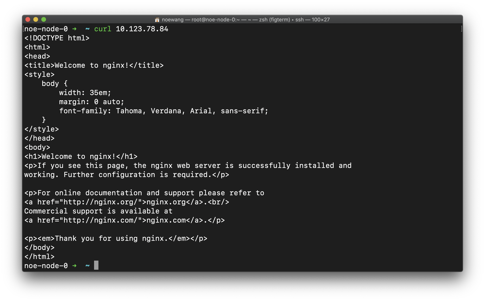
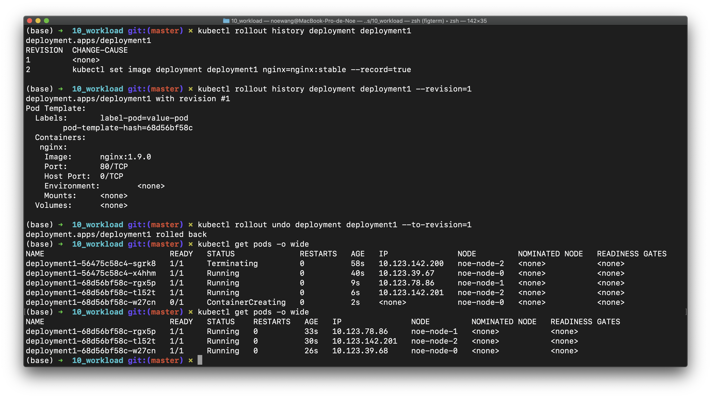
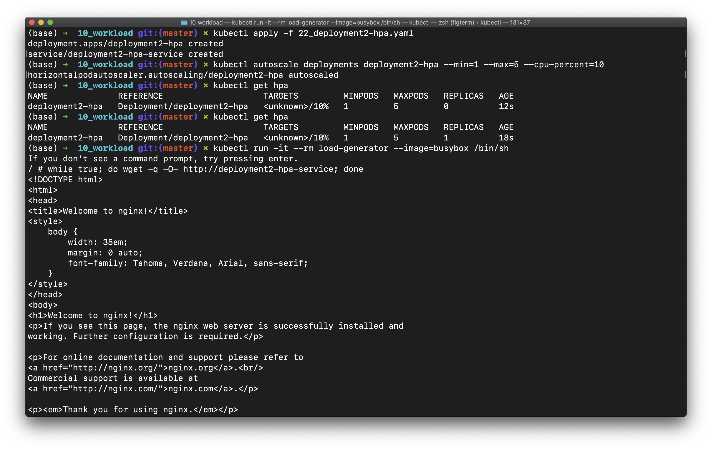
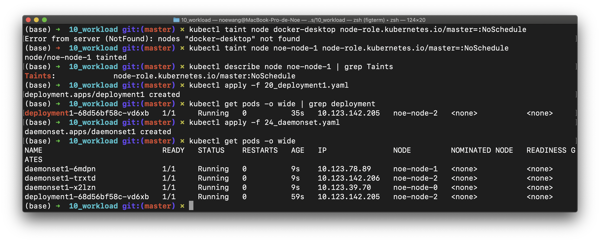
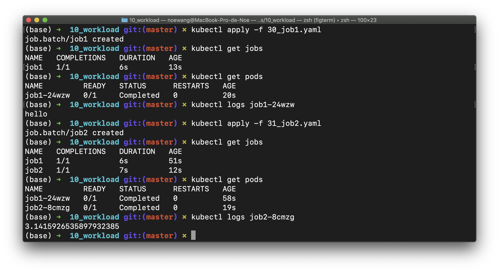
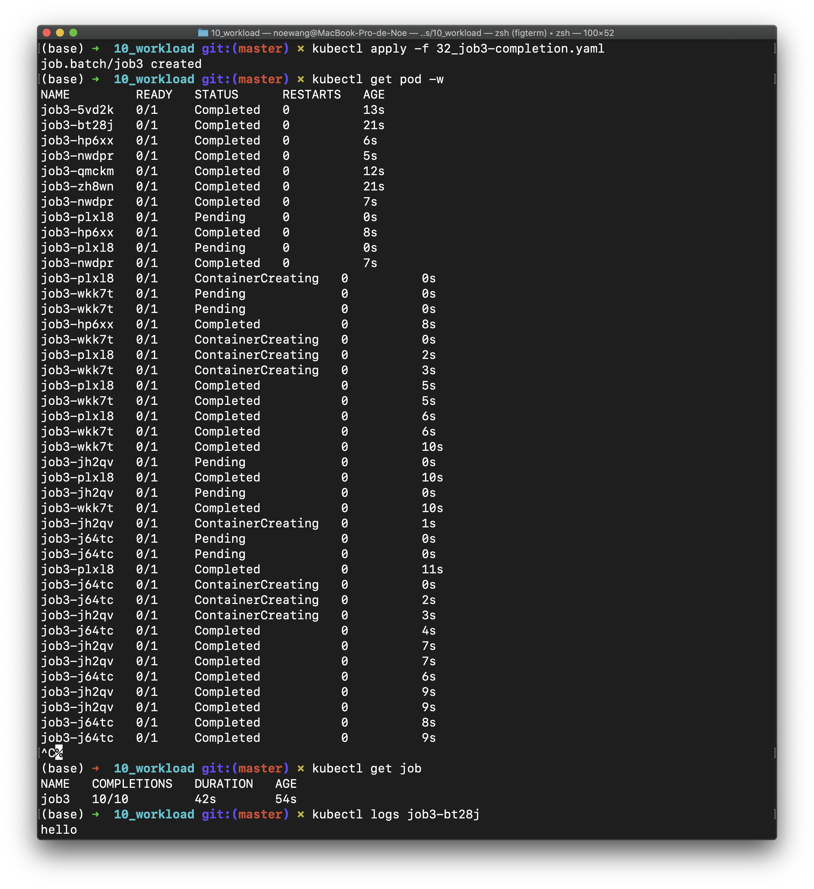
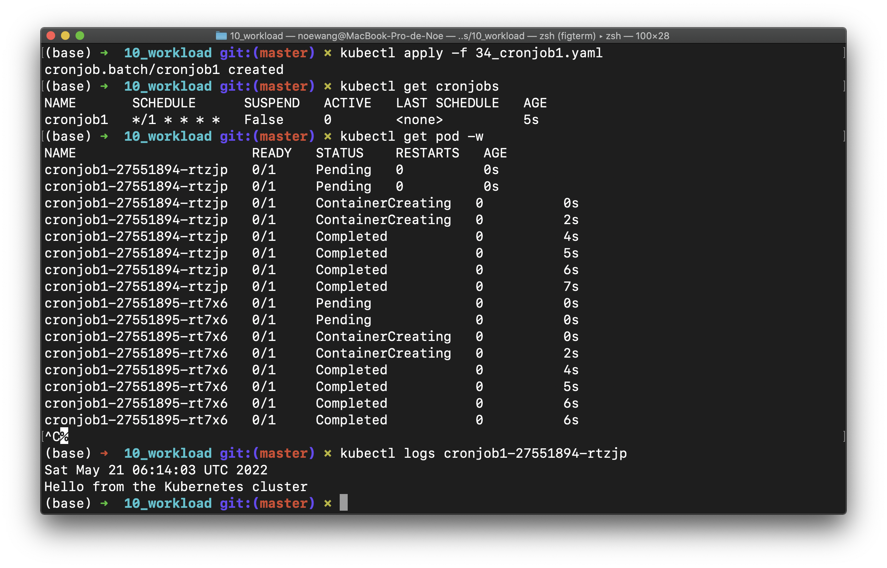

## 6. Workload

### 6.1 ReplicaSet

ReplicaSet ensures a fixed number of running pods through selector. *It is recommended to be replaced by Deployment.*

> 官方推荐Deployment替代ReplicaSet。Deployment是一个更加高级的概念。它通过管理ReplicaSet间接管理Pod，并且支持声明式更新

##### Labels

- metadata/labels：给上层 deployment 使用的 label
- spec/selector/matchLabels：筛选 pod（spec/template/metadata/labels）的 label

##### 10_replicaset1.yaml

对`10_replicaset1.yaml`注解如下

```yaml
apiVersion: apps/v1
kind: ReplicaSet
metadata:
  name: replicaset1
  labels:
    label-rep: value-rep
spec:
  replicas: 2 # 两个副本
  selector: # 定义两个副本的策略的应用范围
    matchLabels: # 使用matchLabel策略
      label-pod: value-pod # 匹配spec.template.metadata.labbels
  template:
    metadata:
      labels:
        label-pod: value-pod # 和spec.selector.matchLabels保持一致
    spec:
      containers: # 创建了一个nginx容器
      - name: nginx
        image: nginx:1.9.0
        imagePullPolicy: IfNotPresent
        ports:
        - containerPort: 80
```

终端运行

```shell
kubectl apply -f 10_replicaset1.yaml # create replicaset
kubectl get replicasets # list replicasets
kubectl delete replicasets replicaset1 # delete replicaset
```


撤销更改(二选一)：

-  `kubectl delete replicasets replicaset1`
- `kubectl delete -f 10_replicaset1.yaml`

##### 12_replicaset2-node-selector.yaml

对`12_replicaset2-node-selector.yaml`注解如下

```yaml
apiVersion: apps/v1
kind: ReplicaSet
metadata:
  ...
spec:
  ...
  template:
    ...
    spec:
      ...
      nodeSelector:
        zone: xxx # 和之前的实验一样，限定这个ReplicaSet只选择带有zone=xxx标签的节点
```

终端运行

```shell
kubectl label nodes noe-node-1 zone=xxx
kubectl apply -f 12_replicaset2-node-selector.yaml
kubectl get replicasets # list replicasets
kubectl label nodes noe-node-1 zone- # unlabel zone
kubectl label nodes noe-node-1 zone=yyy
kubectl apply -f 12_replicaset2-node-selector.yaml
kubectl get replicasets
# all the pods are pending since they cannot find a node
kubectl label nodes noe-node-1 zone- # unlabel zone
```


> 你需要先把pod删除，再次创建。第二次apply并不会重新部署pod.
>
> pod在创建的时候会进行标签选择，第二次apply不会重新创建pod，因此我们观察到pod依然是READY状态。

调度完成后，删除或者修改标签，都不会使得已经调度的Node重新变为Pending。此时如果重新应用配置，kubectl将不会做出更改（因为配置文件没变）。只有删除配置文件后修改Label，再重新部署配置，Pod才会因为找不到合适的Node而变为Pending状态

> `$NODE_ID`要替换成集群中某一节点的实际ID
>
> `zone=xxx`是一个标记node属于哪一个区的手段，对应`12_replicaset2-node-selector.yaml`中的`spec.template.spec.nodeSelector`


### 6.2 Deployment

部署表示用户对 K8s 集群的一次更新操作。部署是一个比 RS 应用模式更广的 API 对象，可以是创建一个服务、更新一个新的服务，也可以是滚动升级一个服务。滚动升级一个服务，实际是创建一个新的 RS，然后逐渐将新 RS 中副本数增加到理想状态，将旧 RS 中的副本数减小到 0 的复合操作。这样一个复合操作用一个 RS 是不太好描述的，所以用一个更通用的 Deployment 来描述。以 K8s 的发展方向，未来对所有长期伺服型的的业务的管理，都会通过 Deployment 来管理。

#### 6.2.1 Label

- metadata/labels：给上层 service 使用的 label
- spec/selector/matchLabels：
    - replicaSet/metadata/labels 使用的 label
    - 筛选 pod，必须与 spec/template/metadata/labels 相同
    - 后面 service 用到的 deployment 的 label：**必须与 selector 的 label 相同**

#### 6.2.2 CMD

- list deployments

    - `kubectl get deployments`

- create

    - `kubectl run DEP_NAME --image=IMG_NAME --image-pull-policy=IfNotPresent --port=80 --replicas=3`
    - `kubectl apply -f DEP.yaml`: create a deployment through a YAML file

- edit

    - `kubectl edit deployment DEP_ID`: edit deployment

- delete

    - `kubectl delete deployment DEP_ID`

- upgrade/rollout

    - ```
        kubectl set image deployment DEP_ID CT_ID=IMG_ID --record
        ```

        : upgrade image，并且通过record来记录

        - `kubectl set image deployment nginx-deployment nginx=nginx:latest --record`

    - ```
        kubectl rollout history deployment DEP_ID
        ```

        : list all the revision

        - `kubectl rollout history deployment DEP_ID --revision=1`: detail the revision

    - `kubectl rollout status deployment DEP_ID`: show rollout operation status

    - `kubectl roolout undo deployment DEP_ID --to-revision=4`: switch to revision 4

    - `kubectl rolling-update DPL_ID -f xxx-dpl.yaml`

- scaling

    - `kubectl scale deployments DEP_ID --replicas=4`: scale up

- autoscale

    - `kubectl autoscale deployments DEP_ID --min=3 --max=5 --cpu-percent=10`

#### 6.2.3 Lab

##### run by CMD

```shell
kubectl run dep-nginx --image=nginx:1.9.0 --image-pull-policy=IfNotPresent
```


可以看到，`kubectl run`只是启动了一个Pod

> K8S v1.18后，官方弃用了`--replicas=2`这一Flag，因此命令需要修改成

##### Scale & upgrade

```shell
kubectl apply -f 20_deployment1.yaml # create a deployment with 2 replicas
kubectl get deployment
kubectl get pods -o wide # get pod IP
[noe-node-0] $ curl 10.123.78.84 # check the Nginx server
```

> `10.123.78.84`为Pod的ClusterIP，需要登陆集群访问




下列语句允许我们：

- 将该服务拓展到三个副本
- 升级服务的镜像（滚动更新）
- 对服务的部署进行回滚

```shell
kubectl scale deployment deployment1 --replicas=3 # scale out
kubectl set image deployment deployment1 nginx=nginx:stable --record 
# upgrade image
kubectl get pods -o wide
```


```shell
kubectl rollout history deployment deployment1 # 查看history
kubectl rollout history deployment deployment1 --revision=1 # 查看版本1细节
kubectl rollout undo deployment deployment1 --to-revision=1 # 退回到版本1
```

> - v1.23.6客户端提示`--record`已经被弃用了，并且会被一种新的机制取代。详见[PR#102873](https://github.com/kubernetes/kubernetes/pull/102873)
>
> - `deployment1`为deployment的ID



##### Horizontal Pod Autoscaler(HPA)

Horizontal Pod Autoscaler(HPA) 是K8S的一种资源对象，能够根据某些指标对在statefulSet, replicaController, replicaSet等集合中的Pod数量进行动态伸缩，使运行在上面的服务对指标的变化有一定的自适应能力。

为了访问指标数据，需要安装**metric-server**，如果集群支持`kubectl top`命令，则该服务可能已经安装了

对`22_deployment2-hpa.yaml`解释如下：

```yaml
apiVersion: v1
kind: Service
metadata:
  name: deployment2-hpa-service
  labels:
    app: nginx
spec:
  selector:
    app: nginx
  ports:
    - port: 80
```

和普通的Deployment相比，不仅添加了CPU/内存的限制，还新增了一个Service资源，将Pod包装成了服务。这样一来`kubectl autoscale`就可以对其操作，使其根据CPU指标进行放缩

```shell
kubectl apply -f 22_deployment2-hpa.yaml
kubectl autoscale deployments deployment2-hpa --min=1 --max=5 --cpu-percent=10
kubectl get hpa
kubectl run -it --rm load-generator --image=busybox /bin/sh
[ct] $ while true; do wget -q -O- http://deployment2-hpa-service; done
```




> 运行一段时间后，发现TARGET发生了变化，这就是autoscale 的效果

`kubectl run --rm`可以看做`docker run`在集群上的表现。`kubectl --rm`可以在命令结束后删除Pod，正如`docker --rm`在命令结束后删除容器一样


### 6.3 DaemonSet

长期伺服型和批处理型服务的核心在业务应用，可能有些节点运行多个同类业务的 Pod，有些节点上又没有这类 Pod 运行。而后台支撑型服务的核心关注点在 K8s 集群中的节点（物理机或虚拟机），要保证每个节点上都有一个此类 Pod 运行。节点可能是所有集群节点也可能是通过 nodeSelector 选定的一些特定节点。典型的后台支撑型服务包括存储、日志和监控等在每个节点上支撑 K8s 集群运行的服务。

#### CMD

```shell
kubectl taint node noe-node-1 node-role.kubernetes.io/master=:NoSchedule # 禁止向docker-desktop节点调度
kubectl describe node noe-node-1 | grep Taints
kubectl apply -f 20_deployment1.yaml # pod将不会向docker-desktop调度，如果没有别的节点，其一直属于pending状态，无法调度
kubectl get pods -o wide | grep deployment
kubectl apply -f 24_daemonset.yaml # pod可以调度
kubectl get pods -o wide 
```



### 6.4 Job

Job 是 K8s 用来控制批处理型任务的 API 对象。批处理业务与长期伺服业务的主要区别是批处理业务的运行有头有尾，而长期伺服业务在用户不停止的情况下永远运行。Job 管理的 Pod根据用户的设置把任务成功完成就自动退出了。成功完成的标志根据不同的 spec.completions 策略而不同：单 Pod 型任务有一个 Pod 成功就标志完成；定数成功型任务保证有 N 个任务全部成功；工作队列型任务根据应用确认的全局成功而标志成功。

Job 对应的 restartPolicy 只能是 never 或 OnFailure。

Job 管理的 Pod根据用户的设置把任务成功完成就自动退出了，而长期伺服业务在用户不停止的情况下永远运行。

#### 6.4.1 CMD

```shell
kubectl taint node docker-desktop node-role.kubernetes.io/master=:NoSchedule # 禁止向docker-desktop节点调度
kubectl apply -f 20_deployment1.yaml # pod将不会向docker-desktop调度，如果没有别的节点，其一直属于pending状态，无法调度
kubectl apply -f 24_daemonset.yaml # pod可以调度
kubectl get pods -o wide
```

#### 6.4.2 Lab

##### Simple Job

```shell
kubectl apply -f 30_job1.yaml
kubectl get jobs
kubectl get pods
kubectl logs job1-xxxx
kubectl apply -f 31_job2.yaml
kubectl get jobs
kubectl get pods
kubectl logs job2-xxxx
kubectl delete jobs --all
kubectl get jobs
kubectl get pods
```



>  `job1-xxxx`需要替换为为具体的Job ID
>
> `kubectl delete jobs.batch --all`可以删除所有的Jobs

##### Completion Job

Job 会启动多个 pod 完成completion

- completions：总共需要执行 job 的次数
- parallelism：并行执行 job 数

```shell
kubectl apply -f 32_job3-completion.yaml
kubectl get pod -w
kubectl get job
kubectl logs job3-xxx
```



##### Cronjob

CronJob 即定时任务，就类似于 Linux 系统的 crontab，在指定的时间周期运行指定的任务。

> 1.21版本以前使用 CronJob 需要开启batch/v2alpha1 API。1.21版本以后，CronJob被纳入了`batch/v1`中

- `.spec.schedule` 指定任务运行周期，格式同Cron 分 时 日 月 周
- `.spec.jobTemplate` 指定需要运行的任务，格式同Job
- `.spec.startingDeadlineSeconds` 指定任务开始的截止期限
- `.spec.concurrencyPolicy` 指定任务的并发策略，支持Allow、Forbid和Replace三个选项

```shell
kubectl apply -f 34_cronjob1.yaml
kubectl get cronjobs
kubectl get pod -w
kubectl logs cronjob1-xxxxxxxx-yyyyy
```



### 6.5 StatefulSet

在云原生应用的体系里，有下面两组近义词；第一组是无状态（stateless）、牲畜（cattle）、无名（nameless）、可丢弃（disposable）；第二组是有状态（stateful）、宠物（pet）、有名（having name）、不可丢弃（non-disposable）。

RC和RS主要是控制提供无状态服务的，其所控制的Pod的名字是随机设置的，一个Pod出故障了就被丢弃掉，在另一个地方重启一个新的Pod，名字变了、名字和启动在哪儿都不重要，重要的只是Pod总数；而StatefulSet是用来控制有状态服务，StatefulSet中的每个Pod的名字都是事先确定的，不能更改。StatefulSet中Pod的名字的作用，是关联与该Pod对应的状态。

对于RC和RS中的Pod，一般不挂载存储或者挂载共享存储，保存的是所有Pod共享的状态，Pod像牲畜一样没有分别；对于StatefulSet中的Pod，每个Pod挂载自己独立的存储，如果一个Pod出现故障，从其他节点启动一个同样名字的Pod，要挂载上原来Pod的存储继续以它的状态提供服务。

适合于StatefulSet的业务包括数据库服务MySQL和PostgreSQL，集群化管理服务Zookeeper、etcd等有状态服务。StatefulSet的另一种典型应用场景是作为一种比普通容器更稳定可靠的模拟虚拟机的机制。传统的虚拟机正是一种有状态的宠物，运维人员需要不断地维护它，容器刚开始流行时，我们用容器来模拟虚拟机使用，所有状态都保存在容器里，而这已被证明是非常不安全、不可靠的。使用StatefulSet，Pod仍然可以通过漂移到不同节点提供高可用，而存储也可以通过外挂的存储来提供高可靠性，StatefulSet做的只是将确定的Pod与确定的存储关联起来保证状态的连续性。StatefulSet已经进入kubernetes的v1标准中。

StatefulSet 的命名需要遵循DNS 子域名规范。

`35_stateful.yaml`给出了StatefulSet的一个例子
