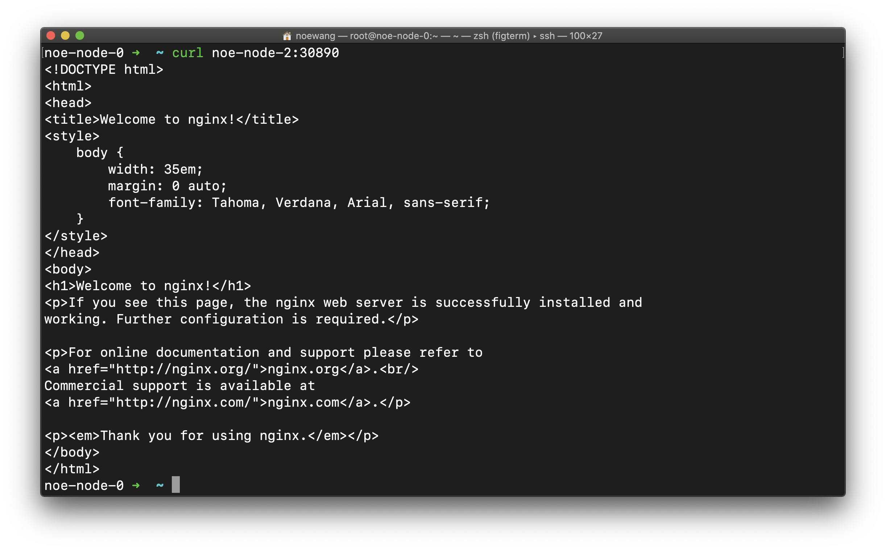
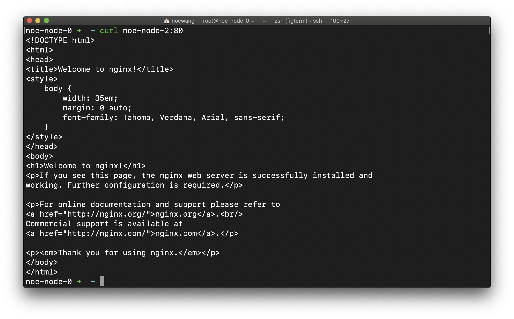
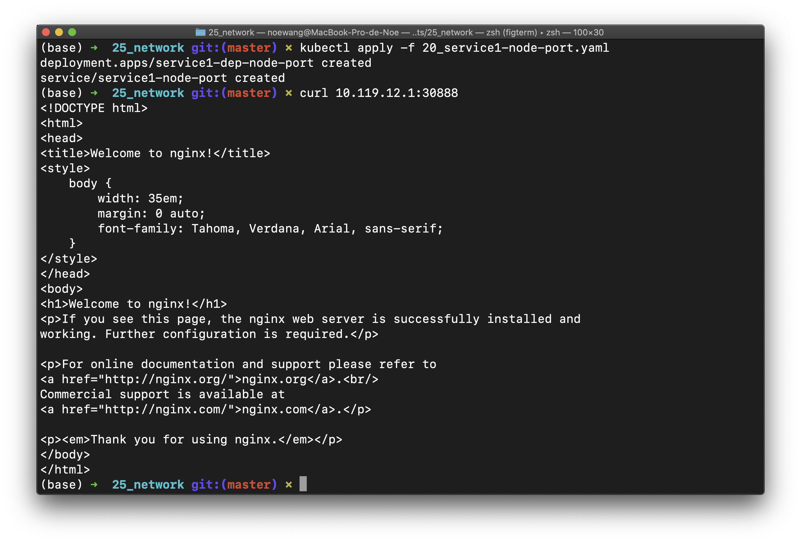
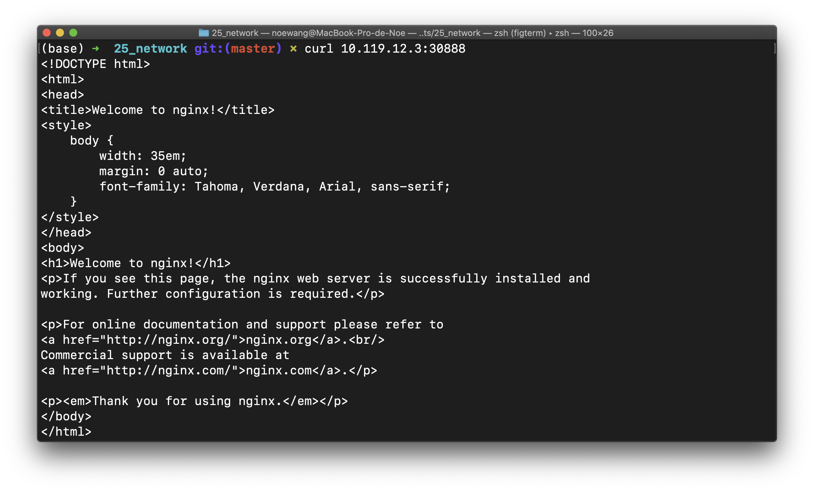
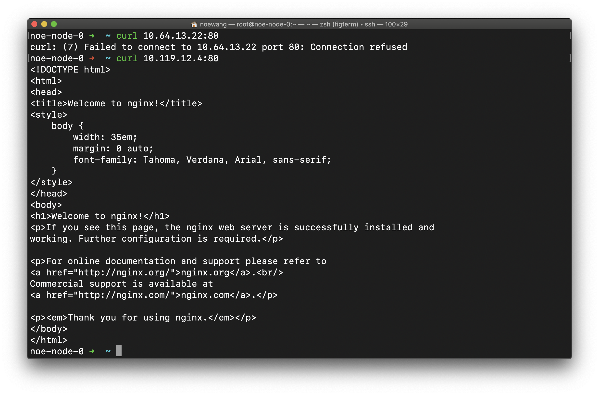
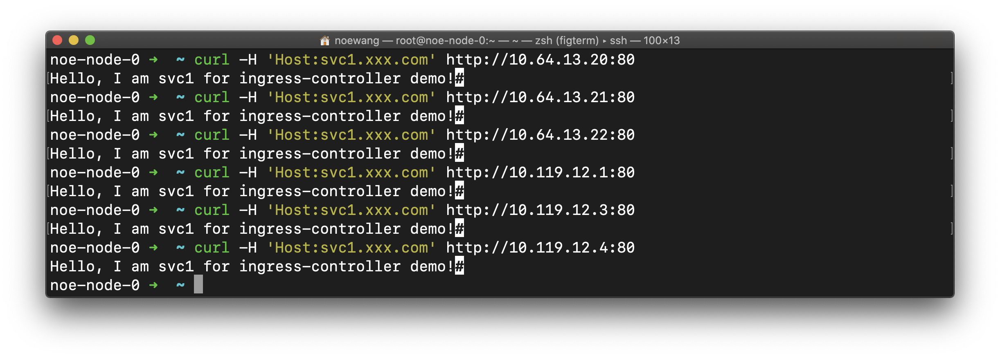

## 9. Network

k8s的网络模型特点如下：

- IP-per-Pod：
    - 每个 Pod 都拥有一个独立 IP 地址
    - Pod 内所有容器共享一个网络命名空间
- 扁平网络：集群内所有 Pod 都在一个直接连通的扁平网络中，可通过 IP 直接访问
    - 所有容器之间无需 NAT 就可以直接互相访问
    - 所有 Node 和所有容器之间无需 NAT 就可以直接互相访问
    - 容器自己看到的 IP 跟其他容器看到的一样
- 内网分离：
    - Service cluster IP 实现 Load Balance，尽可在集群内部访问
    - 外部请求需要通过 NodePort、LoadBalance 或者 Ingress 来访问

### 9.1 hostPort

hostPort 相当于`docker run -p <hsotPort>:<containerPort>`，为容器在主机上做个 NAT 映射，不用创建 SVC，因此端口只在容器运行的Node上监听，其无法负载多Pod。

##### 10_pod1-host-port.yaml

```yaml
apiVersion: v1
kind: Pod
metadata:
  name: pod1-host-port
  labels:
    app: webapp
spec:
  containers:
    - name: ct-nginx
      image: nginx:1.9.0
      imagePullPolicy: IfNotPresent
      ports:
        - containerPort: 80
          hostPort: 30890 # 通过所在节点的 30890 端口访问，
```

> 这里是将host的30890端口转发给container的80端口，对其进行一个保护，此时，我们并不能通过`noe-node-2:80`来访问服务，只能通过`noe-node-2:30890`来访问服务。

```shell
kubectl apply -f 10_pod1-host-port.yaml
```

我们需要定位到该Pod调度的节点

```shell
kubectl get pods -o wide | grep pod1-host
```


因此，我们登陆集群，然后用curl测试该Pod的访问性

```shell
[noe-node-0] $ curl noe-node-2:30890
```



```shell
kubectl delete -f 10_pod1-host-port.yaml # 用完记得删除
```

> Docker-Desktop 搭建的集群无法在宿主机上使用这种方法测试，而是需要Attach到对应的容器中

### 9.2 hostNetwork

hostNetwork相当于 `docker run --net=host`，与主机共享 network 网络栈，不用创建SVC，因此端口只在容器运行的node上监听。

##### 12_pod2-host-network.yaml

```yaml
apiVersion: v1
kind: Pod
metadata:
  name: pod2-host-network
  labels:
    app: webapp
spec:
  hostNetwork: true
  containers:
    - name: ct-nginx
      image: nginx:1.9.0
      ports:
        - containerPort: 80 # Pod的80端口被映射到了主机
```

> 这里如果我们不指定hostport，那么hostport默认等于containerport，但是并不是直接和container访问，而是通过host的80端口，转发到container的80端口。

```shell
kubectl apply -f 12_pod2-host-network.yaml
```

Pod的80端口被映射到了主机。我们可以用`http://noe-node-2:80`访问该服务



### 9.3 nodePort

在nodePort下，由 kube-proxy 操控为所有节点统一配置 iptables 规则。因此，SVC 上的 nodePort 会监听在所有的节点上。即使只有 1 个 Pod/服务副本，用户也可以通过访问**任意节点**的 nodePort 使用到这个服务。

##### 20_service1-node-port.yaml

```yaml
apiVersion: apps/v1
kind: Deployment
metadata:
  name: service1-dep-node-port
  labels:
    app: nginx
spec:
  replicas: 2
  selector:
    matchLabels:
      app: nginx
  template:
    metadata:
      labels:
        app: nginx
    spec:
      containers:
        - name: nginx
          image: nginx:1.9.0
          imagePullPolicy: IfNotPresent
          ports:
            - containerPort: 80
---
apiVersion: v1
kind: Service
metadata:
  name: service1-node-port
spec:
  selector:
    app: nginx
  type: NodePort
  ports:
    - protocol: TCP
      targetPort: 80 
      port: 8888
      nodePort: 30888 
```

终端运行

```shell
kubectl apply -f 20_service1-node-port.yaml
```

我们可以尝试在外部直接访问该服务

```shell
curl 10.119.12.1:30888
```

> 10.119.12.1是noe-node-0的外部IP



我们可以通过访问`noe-node-1`的`30888`端口来访问该服务（注意：**任意**节点）

```shell
curl 10.119.12.3:30888        # noe-node-1 IP:port
```



### 9.4 externalIP

nodeport会监听在所有的节点上，有时候我们不想要这样。这时候可以通过SVC来实现pod间的负载，实现只监听某台指定node上的节点。

##### 22_service2-external-ip.yaml

```yaml
apiVersion: apps/v1
kind: Deployment
metadata:
  name: service1-dep-external-ip
  labels:
    app: nginx
spec:
  replicas: 2 # 创建了两个副本
  selector:
    matchLabels:
      app: nginx
  template:
    metadata:
      labels:
        app: nginx
    spec:
      containers:
        - name: nginx
          image: nginx:1.9.0
          imagePullPolicy: IfNotPresent
          ports:
            - containerPort: 80
---
apiVersion: v1
kind: Service
metadata:
  name: service2-external-ip
spec:
  selector:
    app: nginx
  ports:
    - protocol: TCP
      port: 80
  externalIPs:
    - <YOUR_NODE_IP> # 需要替换成一个Node的IP
```

> ！！！！！`<YOUR_NODE_IP>`部分需要替换成**Node的外部IP**（即从集群外访问Node使用的IP）这个IP是为了设置iptables用的。如果使用了内部IP，则来自外部的通讯会被iptables拒绝，服务就只能在集群内访问了。
>
>  另一方面如果`<YOUR_NODE_IP>`被设置成了集群节点网卡获得的IP，而Replica数量又大于1，最终导致多个Pod调度到了同一个节点。则会发生重复绑定的问题。如果它们没有调度到一个节点，就会出现不在改网卡节点的Pod无法启动的问题。 因此，我们需要将`<YOUR_NODE_IP>`替换成一个外部浮动IP

我们将该地址设置为`node2`的外部浮动IP，即`10.119.12.4`

```shell
kubectl apply -f 22_service2-external-ip.yaml
```

在集群外，通过`10.119.12.4`访问失败。这可能是因为我们节点托管的云主机在浮动IP的处理上的问题。


在集群内，我们使用`10.64.13.22`访问该服务失败，但是通过`10.119.12.4`访问成功。



### 9.5 Ingress Controller

> [Ingress](https://ingress.fandom.com/wiki/Ingress) is **also** an augmented reality massively multiplayer online role-playing location-based game created by Niantic Labs.

通常情况下，service 和 pod 的 IP 仅可在 k8s 集群内部访问，k8s 集群外部的请求需要转发到 service 在 Node 上暴露的 NodePort 上，然后再由 kube-proxy 将其转发给相关的 Pod。**而 Ingress 就是为进入 k8s 集群的请求提供路由规则的集合。**Ingress 其实就是从 K8s 集群外部访问集群的一个入口，将外部的请求转发到集群内不同的 Service 上，其实就相当于 nginx、haproxy 等 LB，<u>所以 ingress 其实是为了代理不同后端 Service 而设置的路由服务。</u>Ingress 是 L7 的路由，而 Service 是 L4 的负载均衡，Ingress Controller 基于 Ingress 规则将 client 的 request 直接转发到 service 对应的后端 endpoint（即 pod）上，这样会跳过 kube-proxy 的转发功能。

Ingress Controller 可以理解为一个监听器，通过不断地监听 kube-apiserver，实时的感知后端 Service、Pod 的变化，当得到这些信息变化后，Ingress Controller 再结合 Ingress 的配置，更新反向代理负载均衡器，达到服务发现的作用。其实这点和服务发现工具 consul、 consul-template 非常类似。Ingres Controller 以 DaemonSet 的形式创建，在每个 node 上以 Pod hostPort 的方式启动一个 Nginx 服务。它保持 watch Apiserver 的 /ingress 接口以更新 Ingress 资源，以满足 Ingress 的请求。现在可以供大家使用的 Ingress Controller 有很多，比如 traefik、nginx-controller、Kubernetes Ingress Controller for Kong、HAProxy Ingress controller，当然你也可以自己实现一个 Ingress Controller，现在普遍用得较多的是 traefik 和 nginx-controller。

[](https://github.com/rebirthmonkey/k8s/blob/master/20_objects/25_network/30_ingress/figures/wecom-temp-9204c69f289f503689a97a26ead4acc7.png)


Ingress Controller首先是一种特殊的、独立的Pod资源，而不是和DaemonSet 、Deployment等同的概念。一般来说，Ingress Controller就是一个运行着有七层代理能力或调度能力的应用，比如：[NGINX](https://nginx.org/en)、[HAproxy](https://www.haproxy.org/)、[Traefik](https://traefik.io/)、[Envoy](https://www.envoyproxy.io/)。Ingress应该使用DaemonSet部署在每一个节点上，并且位于kube-system命名空间

```mermaid
graph LR
  C0([Client]) -.-> |LB| I0
  subgraph K8S Cluster
    I0[Ingress] --> |Ingress Routing<br> L7| S[Service]
    S --> |L4| P0[Pod]
    S --> |L4| P1[Pod]
  end
```

Serviced的缺陷是它的工作基于iptables或ipvs的，**只是工作在TCP/IP协议栈**。Service是无法调度外部的HTTPS请求到内部的HTTP服务，并实现负载均衡（证书和私钥的配置问题）。另一个例子是SSO认证问题。外部DNS解析一般是基于域名解析，解析到的地址也是负载均衡调度器的地址。而SSO会话是微服务的后端服务器建立的连接，因此需要每一台后端服务器都配置证书，增大开销。如果我们认为内部网络是安全的，就可以在接入层卸载SSO会话。这时候，集群外部使用HTTPS通信，内部使用HTTP通信。调度器Pod运行一个**七层的应用代理**。<u>当用户请求时，先到达这个独特的调度器，而不是直接到达后端的Pod，Pod和Pod之间由于是在同一网段可以直接通信，无需经过Service。这个Pod就叫做Ingress Controller。</u>

**Service是L4的负载均衡，Ingress是L7的路由。**

Ingress则是K8S对象的一员，它负责生命Ingress需求。例如

```yaml
apiVersion: extensions/v1beta1
kind: Ingress
metadata:
  name: test
spec:
  rules:
  - host: foo.bar.com
    http:
      paths:
      - path: /foo # 可以省略代表`/`根路径
        backend:
          serviceName: s1
          servicePort: 80
      - path: /bar
        backend:
          serviceName: s2
          servicePort: 80
```

就定义了两条Path（`/foo`, `/bar`）的Ingress需求

我们主要实验Ingress的集中较为常见的使用场景：

- 外部HTTPS流量进入集群后，卸载为HTTP流量
- 外部HTTPS流量，在Ingress Controller卸载，然后重新加密为SSL
- 外部HTTPS流量，不进行卸载，直接定向到后端

HTTPS需要证书。我们可以用openssl工具生成一个

```shell
openssl req -x509 -nodes -days 365 -newkey rsa:2048 \ 
                  -keyout <KEY_FILENAME> -out <CERT_FILENAME> \
                  -subj "/CN=*.xxx.com/O=xxx.com"
```

!!! note `-days` 是证书的有效期 `CN=*.xxx.com`代表一个通配符证书，`O=xxx.com`是组织名。`/`分割。还有很多其他的信息可以附加到这个参数中， `<KEY_FILENAME>`是密钥的输出路径， `<CERT_FILENAME>` 是证书的输出路径。

在测试Ingress的时候，我们需要让客户端的请求带上合适的请求头`curl -H`可以做到这一点

```shell
curl -H "Host:svc.xxx.com"
```

会让请求报头指定的服务器的域名设置为`svc.xxx.com`，这就模拟了通过域名浏览的行为，而不必真正购买域名设置解析。

#### 实验1 - 安装ingress-nginx

Ingress Controller需要安装在集群上。推荐的方法是通过Helm安装，但不完全通过Helm安装。

> 可以通过[Helm-Install](https://helm.sh/zh/docs/intro/install/)获取安装Helm安装的方法。

Helm安装K8S应用有如下阶段

1. 向Helm添加Repo。一个Repo就像是一个静态的站点
2. Helm从Report下载Charts（tgz格式）
3. Helm解压Charts，根据Charts部署APP

由于网络原因，我们显然需要对这个过程加以改动:

1. 使用代理下载Charts
2. 修改Charts中引用的镜像，替换成可以下载的

执行以下命令

```shell
helm repo add ingress-nginx https://kubernetes.github.io/ingress-nginx # 添加Repo
helm repo update
helm fetch ingress-nginx/ingress-nginx
tar -xvf ingress-nginx-x.xx.x.tgz
```

> `x.xx.x`为下载的ingress-nginx版本

将会把ingress-nginx的Charts解压到当前目录的ingress-nginx子目录下。我们需要修改其中的`values.yaml`以适应我们的集群。我们的集群有如下特点：

1. 没有外部的LB设施
2. 没有安装内部的LB设施（例如MetalLB）
3. 存在多个出口节点
4. `k8s.gcr.io/ingress-nginx/kube-webhook-certgen`和`k8s.gcr.io/ingress-nginx/controller`镜像可能会无法下载，因此需要替换

修改values.yaml如下

```yaml
# values-prod.yaml
controller:
  name: controller
  image:
    registry: registry.hub.docker.com
    image: davidliyutong/ingress-nginx-controller # 镜像替换
    digest: # 需要把digest清零或者修改成正确的值

  dnsPolicy: ClusterFirstWithHostNet # 使用K8S的DNS
  
  extraArgs: # SSL-Passthrough 实验中需要的功能
    enable-ssl-passthrough:

  hostNetwork: true # 使用宿主网络，这将会占用所有出口的80/443端口

  publishService:  
  # hostNetwork 模式下设置为false，通过节点IP地址上报ingress status数据，不创建服务
    enabled: false

  kind: DaemonSet

  # nodeSelector: 
    # role: lb # 如果添加该选项，则只有存在role=lb的节点上才会有Pod

  service:  # HostNetwork 模式不需要创建service
    enabled: false
  
  admissionWebhooks:
    patch:
      enabled: true
      image:
        registry: registry.hub.docker.com
        image: davidliyutong/ingress-nginx-kube-webhook-certgen # 镜像替换
        digest: 
        
defaultBackend: # 路由没有命中时候的404页面提供方
  enabled: true
  name: defaultbackend
  image:
    registry: registry.hub.docker.com
    image: davidliyutong/ingress-nginx-defaultbackend-amd64  # 镜像替换
    digest: 
```

我们需要创建一个ingress-nginx的命名空间，然后在该命名空间内安装`ingress-nginx`。这样的好处是卸载的时候只需要删除该命名空间，就可以删除所有的安装。

```shell
kubectl create ns ingress-nginx
```

最后，手动安装ingrex-nginx

```shell
helm install --namespace ingress-nginx ingress-nginx ./ingress-nginx \
             -f ./ingress-nginx/values.yaml
```

所有Controller都READY标志着部署成功

```shell
kubectl get pods -n ingress-nginx -o wide
```


> `helm uninstall ingress-nginx` 可以反安装 `kubectl delete namespace ingress-nginx` 也可以，这是因为所有的ingress-nginx组件都安装在`ingress-nginx`命名空间下
>
> - 注意，每个node都应该有一个ingree的controller，但是如果node有taint，则不会部署。

#### 实验2 - 编译镜像

我们首先创建一系列的自签名证书

##### bootstrap_keys.sh

```shell
#!/bin/bash
cd 12_svc2/
openssl genrsa -out ca.key 1024
openssl req -new -key ca.key -out ca.csr \
            -subj "/C=CN/ST=Zhejiang/L=Hangzhou/O=My\ CA/CN=localhost" # 替换
openssl x509 -req -in ca.csr -signkey ca.key -out ca.crt
openssl genrsa -out server.key 1024
openssl req -new -key server.key -out server.csr \
            -subj "/C=CN/ST=Zhejiang/L=Hangzhou/O=My\ CA/CN=localhost" # 替换
openssl x509 -req -CA ca.crt -CAkey ca.key -CAcreateserial \
             -in server.csr -out server.crt
rm ca.csr ca.srl server.csr
mv server.key ./src/
mv server.crt ./src/
cd ..

openssl req -x509 -nodes -days 365 -newkey rsa:2048 -keyout 14_svc3/ic.key \
            -out 14_svc3/ic.crt -subj "/CN=*.xxx.com/O=xxx.com"

openssl req -x509 -nodes -days 365 -newkey rsa:2048 -keyout 16_svc4/ic.key \
            -out 16_svc4/ic.crt -subj "/CN=*.xxx.com/O=xxx.com"

openssl req -x509 -nodes -days 365 -newkey rsa:2048 -keyout 18_svc5/ic.key \
            -out 18_svc5/ic.crt -subj "/CN=*.xxx.com/O=xxx.com"
```

##### build_images.sh

编译Ingress实验中使用的Docker镜像并且打标签。我们使用一个脚本来交互式地完成这项过程

```shell
#!/bin/bash
read -r -p "Input your docker username:" DOCKER_USERNAME

if [ ! $DOCKER_USERNAME]; then
echo "Username not provided"
exit 1;
fi

cd 10_svc1/src
docker build -t $DOCKER_USERNAME/nginx-ingress-demo-svc1:0.1 .
cd ../..

cd 12_svc2/src
docker build -t $DOCKER_USERNAME/nginx-ingress-demo-svc2:0.1 .
cd ../..

cd 14_svc3/src
docker build -t $DOCKER_USERNAME/nginx-ingress-demo-svc3:0.1 .
cd ../..

cd 16_svc4/src
docker build -t $DOCKER_USERNAME/nginx-ingress-demo-svc4:0.1 .
cd ../..

cd 18_svc5/src
docker build -t $DOCKER_USERNAME/nginx-ingress-demo-svc5:0.1 .
cd ../..

cd svc6/src
docker build -t $DOCKER_USERNAME/nginx-ingress-demo-svc6:0.1 .
cd ../..

read -r -p "Push images ? [y/N]:" PUSH

case $PUSH in 
    [yY][eE][sS]|[yY])
        docker login
        docker push $DOCKER_USERNAME/nginx-ingress-demo-svc1:0.1
        docker push $DOCKER_USERNAME/nginx-ingress-demo-svc2:0.1
        docker push $DOCKER_USERNAME/nginx-ingress-demo-svc3:0.1
        docker push $DOCKER_USERNAME/nginx-ingress-demo-svc4:0.1
        docker push $DOCKER_USERNAME/nginx-ingress-demo-svc5:0.1
        docker push $DOCKER_USERNAME/nginx-ingress-demo-svc6:0.1
        echo "Done"
        ;;

    [nN][oO]|[nN])
        echo "Done"
           ;;

    *)
        echo "Invalid input..."
        exit 1
        ;;
esac
```

该脚本需要在`25_network/30_ingress`目录下执行。脚本首先询问需要使用的Docker用户名，然后将其打上相应的TAG。最后，脚本会询问用户要不要将镜像PUSH到Docker Registry上

#### 实验3 - HTTP-Ingress-HTTP

我们首先分析这个配置文件

##### 10_svc1/ingress.yaml

```yaml
apiVersion: apps/v1
kind: Deployment
metadata:
  name: svc1-deployment
  labels:
    app: nginx-ingress-demo # 和Service.spec.selector匹配
spec:
  replicas: 2
  selector:
    matchLabels: # 和spec.template.metadata.labels匹配
      app: nginx-ingress-demo
  template:
    metadata:
      labels:
        app: nginx-ingress-demo # 和spec.selector.matchLabels匹配
    spec:
      containers:
        - name: ct-go-server
          image: noewangjinyuan/nginx-ingress-demo-svc1:1.0.1
          imagePullPolicy: IfNotPresent
          ports:
            - containerPort: 8080
```

第一部分，启动了一个Go语言编写的服务器

```go
package main

import (
    "fmt"
    "log"
    "net/http"
)

func handler(w http.ResponseWriter, r *http.Request) {
    log.Println("receive a request")
    fmt.Fprintf(w, "Hello, I am svc1 for ingress-controller demo!")
}

func main() {
    http.HandleFunc("/", handler)
    http.ListenAndServe(":8080", nil)
}
```

这个服务器是一个普通的HTTP服务器，运行在8080端口

第二部分，定义了一个服务。该服务类型是ClusterIP，只能在集群内部访问。服务的端口是8888。

```yaml
apiVersion: v1
kind: Service
metadata:
  name: svc1-cluster-ip
spec:
  selector:
    app: nginx-ingress-demo # 和Deployment.metadata.labels匹配
  type: ClusterIP
  ports:
    - protocol: TCP
      targetPort: 8080
      port: 8888
```

第三部分定义了一个Ingress

```yaml
apiVersion: networking.k8s.io/v1
kind: Ingress
metadata:
  name: svc1-ingress
  annotations:
    kubernetes.io/ingress.class: nginx
spec:
  rules:
    - host: svc1.xxx.com
      http:
        paths:
          - path: /
            pathType: Prefix
            backend:
              service:
                name: svc1-cluster-ip
                port: 
                  number: 8888
```

部署服务

```shell
kubectl apply -f 10_svc1/ingress.yaml # launch ingress, service and deployment
kubectl get pods -w # wait until both pods is running 
```


我们现在可以通过集群的**任意一个节点**的IP来访问该服务

```shell
[noe-node-0] $ curl -H 'Host:svc1.xxx.com' http://10.64.13.20:80
[noe-node-0] $ curl -H 'Host:svc1.xxx.com' http://10.64.13.21:80
[noe-node-0] $ curl -H 'Host:svc1.xxx.com' http://10.64.13.22:80
[noe-node-0] $ curl -H 'Host:svc1.xxx.com' http://10.119.12.1:80
[noe-node-0] $ curl -H 'Host:svc1.xxx.com' http://10.119.12.3:80
[noe-node-0] $ curl -H 'Host:svc1.xxx.com' http://10.119.12.4:80
```



删除

```shell
kubectl delete -f 10_svc1/ingress.yaml
```

#### 实验4 - HTTP-Ingress-HTTPS

##### 12_svc2/ingress.yaml

```yaml
...
    spec:
      containers:
        - name: ct-go-server
          image: noewangjinyuan/nginx-ingress-demo-svc2:0.1  # Replace with your image
          imagePullPolicy: IfNotPresent
          ports:
            - containerPort: 8080
...
```

```shell
kubectl apply -f ./12_svc2/ingress.yaml # launch ingress, service and deployment
[noe-node-0] curl -H 'Host:svc2.xxx.com' http://10.119.12.1:80
kubectl delete -f ./12_svc2/ingress.yaml
```

> `10.119.12.1`为集群出口之一的IP


#### 实验5 - HTTPS-Ingress-HTTP

证书的生成已经在`bootstrap_keys.sh`中完成了

```shell
openssl req -x509 -nodes -days 365 -newkey rsa:2048 -keyout 14_svc3/ic.key \
            -out 14_svc3/ic.crt -subj "/CN=*.xxx.com/O=xxx.com" \
            -addext "subjectAltName = DNS:*.xxx.com"
```

> `-addext`是新版GO对证书的要求（必须含有subjectAltName）

##### 14_svc3/ingress.yaml

```yaml
      containers:
        - name: ct-go-server
          image: noewangjinyuan/nginx-ingress-demo-svc3:0.1  # Replace with your image
          imagePullPolicy: IfNotPresent
          ports:
            - containerPort: 8080
```

```shell
kubectl create secret tls secret-tls-svc3 \
        --key 14_svc3/ic.key --cert 14_svc3/ic.crt # create k8s secret
kubectl apply -f ./14_svc3/ingress.yaml # launch ingress, service and deployment
```

我们忽略证书校验来访问服务

```shell
curl -H "Host:svc3.xxx.com" https://10.119.12.1 -k # curl insecure mode
```


接下来，我们尝试让curl正确验证证书后访问服务。curl 使用证书的时候需要把key和cert合并。可以使用cat命令做到这一点

```shell
cat 14_svc3/ic.key >> 14_svc3/ic.crt # Merge key and cert
curl --cert 14_svc3/ic.crt -H "host:svc3.xxx.com" https://10.119.12.1
# doesn't work since the signer isn't authorized
```

可以发现，这时候curl**仍然无法正常工作**。深入研究后发现，要想让curl能够正常验证服务器的自签名证书，服务器的证书必须构成一条完整的信任链。这意味需要满足以下两点之中的一个：

1. 服务器使用购买的证书。该证书是证书机构颁发的
2. 自己在本地搭建证书服务，创建CA证书后用该证书签发中间证书，然后再签发服务器证书（`ic.crt`/`ic.key`。最后在curl命令中添加`--cacert`选项使用自己的证书链验证服务器证书（需要将CA根证书和中间证书合并到同一个文件中


删除资源

```shell
kubectl delete -f ./14_svc3/ingress.yaml
kubectl delete secret secret-tls-svc3
```

#### 实验6 - HTTPS-Ingress-HTTPS (ssl-termination)

##### 16_svc4/ingress.yaml

```yaml
      containers:
        - name: ct-go-server
          image: noewangjinyuan/nginx-ingress-demo-svc4:0.1  # Replace with your image
          imagePullPolicy: IfNotPresent
          ports:
            - containerPort: 8080
```

`16_svc4/src` 中存储了一对证书`server.crt`/`server.key`用于加密Ingress和后端间通讯的流量

```shell
kubectl create secret tls secret-tls-svc4 \
        --key 16_svc4/ic.key --cert 16_svc4/ic.crt # create secret
kubectl apply -f ./16_svc4/ingress.yaml # launch ingress, service and deployment
curl -H 'Host:svc4.xxx.com' https://10.119.12.1:443 -k
```

curl同样需要忽略SSL错误


删除资源

```shell
kubectl delete -f ./16_svc4/ingress.yaml
kubectl delete secret secret-tls-svc4
```

#### 实验7 - HTTPS-Ingress-HTTPS (ssl-passthrough)(tmp)

##### 18_svc5/ingress.yaml

```yaml
      containers:
        - name: ct-go-server
          image: noewangjinyuan/nginx-ingress-demo-svc5:0.1 # Replace with your image
          imagePullPolicy: IfNotPresent
          ports:
            - containerPort: 8080
```

`18_svc5/src` 中存储了一对证书`server.crt`/`server.key`用于加密客户端和后端间通讯的流量。

```shell
kubectl create secret tls secret-tls-svc5 \
        --key 18_svc5/ic.key --cert 18_svc5/ic.crt # create secret
kubectl apply -f ./18_svc5/ingress.yaml # launch ingress, service and deployment
curl -H 'Host:svc5.xxx.com' https://10.119.12.1 -k
```


删除资源

```shell
kubectl delete -f ./18_svc5/ingress.yaml
kubectl delete secret secret-tls-svc5
```

> 需要修改Helm安装ingress-nginx的配置以启用`enable-ssl-passthrough`参数
